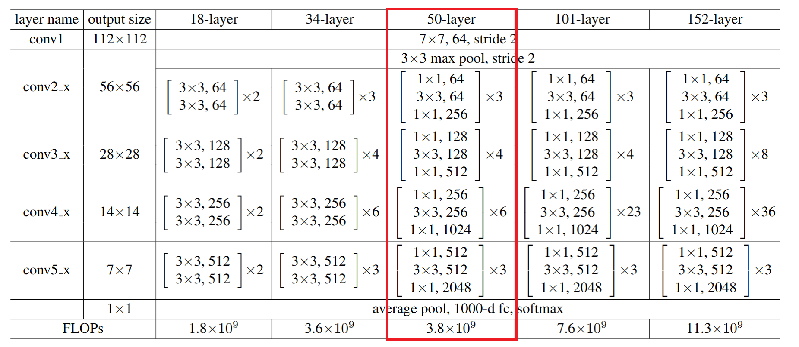
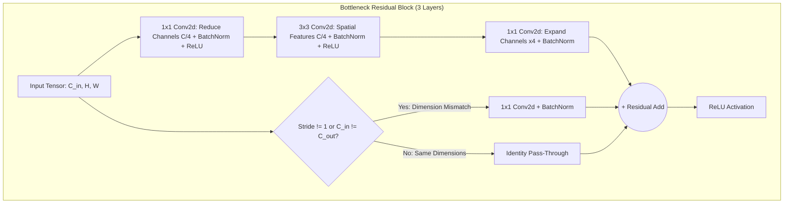
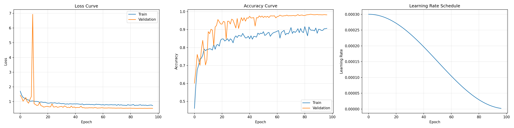
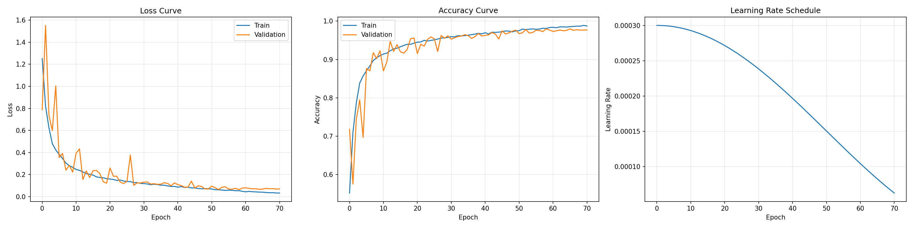
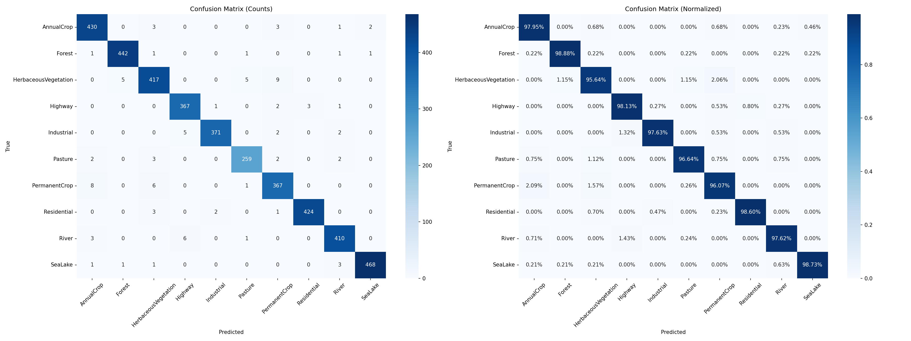
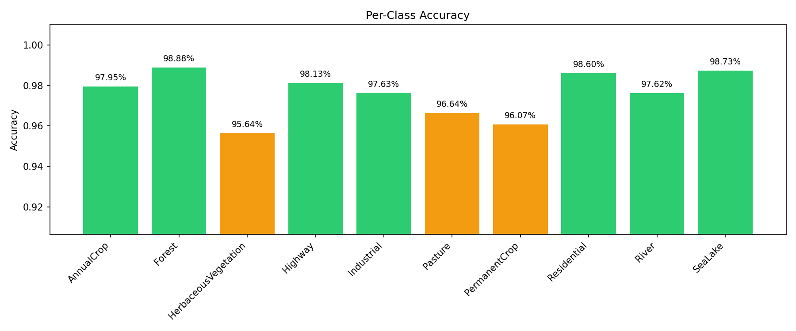
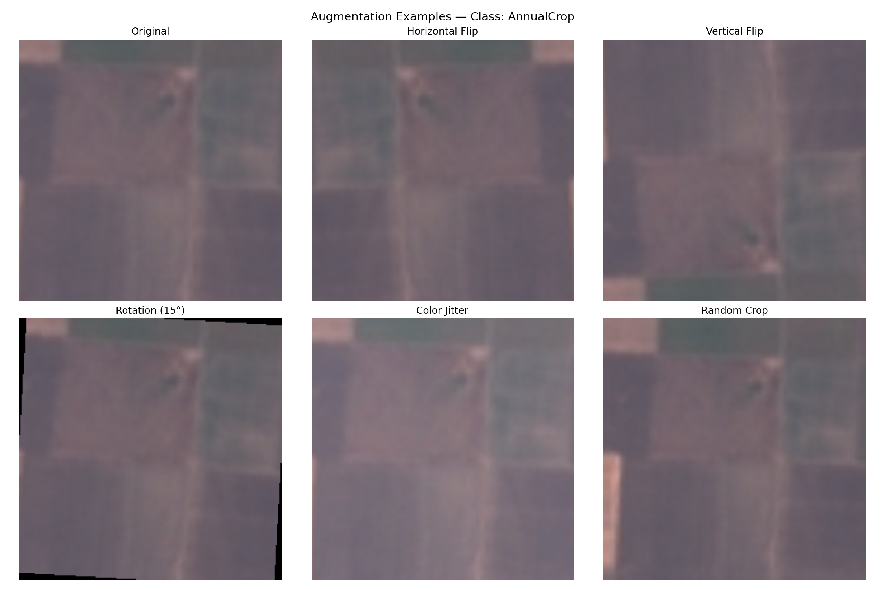
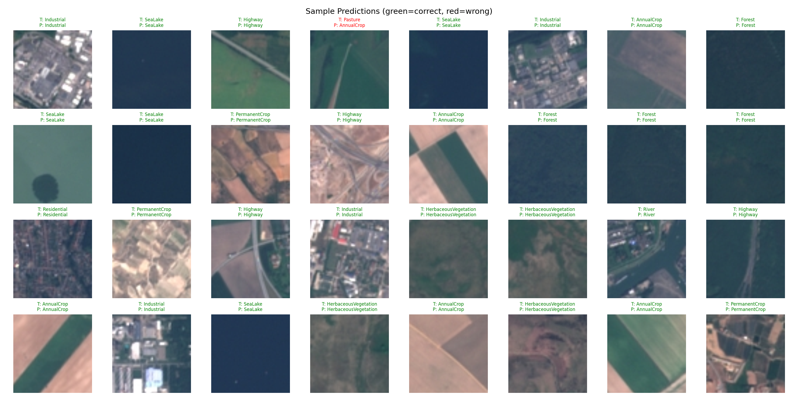
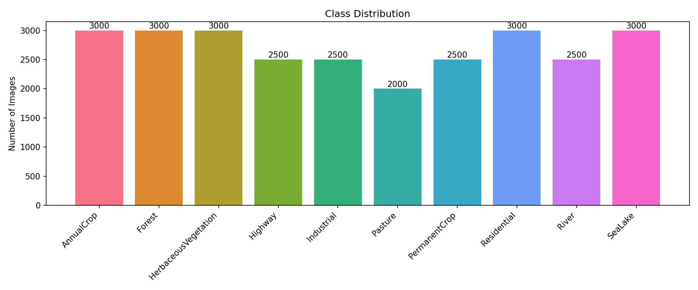

# EuroSAT Land-Use Classification: ResNet-50 Implemented from Scratch

<div align="center">

[](https://www.python.org/)
[](https://pytorch.org/)
[](https://kaggle.com/)
[]()
[]()
[](LICENSE)

**Deep Learning satellite land-use and land-cover classification on Sentinel-2 multispectral imagery. Built with a full 50-layer ResNet written entirely by hand in pure PyTorch — zero pretrained weights, zero torchvision model shortcuts — reaching 98.32% test accuracy.**

[Overview](#-project-overview) • [Scratch Architecture](#-architecture-built-from-scratch) • [Training Evolution & Engineering](#-training-evolution--engineering-insights) • [Quantitative Results](#-benchmarks--quantitative-results) • [Visual Gallery](#-visual-evaluation) • [Quickstart](#-quickstart)

</div>

---

<div align="center">
  
  <p><em>Figure 1: Complete hand-coded ResNet-50 architecture blueprint — Stem, Bottleneck Residual Blocks with skip connections, Downsampling projections, and classification head.</em></p>
</div>

---

## 📌 Project Overview

Satellite land-use and land-cover (LULC) classification is fundamental to environmental monitoring, urban planning, crop yield estimation, and disaster management. The **EuroSAT** benchmark consists of 27,000 georeferenced Sentinel-2 satellite image patches ($64 \times 64$ pixels) spanning 10 distinct terrain and infrastructure classes.

Rather than fine-tuning an off-the-shelf ImageNet model, this project was developed as a rigorous demonstration of **first-principles deep learning engineering**:
* **100% Custom Implementation**: Every single layer (`nn.Conv2d`, `nn.BatchNorm2d`, `nn.ReLU`, residual additions, and projection shortcuts) is hand-crafted without external model libraries.
* **Trained from Scratch**: All ~23.5 million parameters are initialized with Kaiming (He) normal initialization and learned purely from EuroSAT satellite data.
* **Modern Regularization & Optimization**: Leveraged **CutMix data mixing**, **Label Smoothing**, **Cosine Annealing learning rate schedules**, and **Test-Time Augmentation (TTA)** to shatter standard scratch benchmarks (exceeding standard 90–95% expectations to hit **98.32%**).

---

## 🏛 Architecture Built from Scratch

Standard residual networks rely on the residual formulation $\mathcal{H}(x) = \mathcal{F}(x) + x$, allowing gradients to backpropagate directly through the identity shortcut, preventing the vanishing gradient problem in deep 50-layer topologies.



### Full 50-Layer Network Layout

```
Input (3 x 224 x 224)
  │
  ├── Stem: Conv2d(3→64, 7x7, stride=2, padding=3) → BatchNorm → ReLU → MaxPool2d(3x3, stride=2)
  │
  ├── Stage 1: [Bottleneck(64  → 256)]  x 3 blocks  (spatial: 56x56)
  │
  ├── Stage 2: [Bottleneck(128 → 512)]  x 4 blocks  (spatial: 28x28, stride=2 downsampling)
  │
  ├── Stage 3: [Bottleneck(256 → 1024)] x 6 blocks  (spatial: 14x14, stride=2 downsampling)
  │
  ├── Stage 4: [Bottleneck(512 → 2048)] x 3 blocks  (spatial: 7x7, stride=2 downsampling)
  │
  ├── Pooling: AdaptiveAvgPool2d((1, 1)) → (2048-dim embedding)
  │
  └── Classifier Head: Dropout(0.2) → Linear(2048, 10 classes)
```

* **Initialization**: Kaiming Normal (`fan_out` mode, `nonlinearity='relu'`) on all 2D convolutional kernels; Batch Normalization weights initialized to 1.0 and biases to 0.0.
* **Resolution Upsampling**: 64x64 native Sentinel-2 patches are bilinearly interpolated and augmented at $224 \times 224$ to preserve fine spatial details inside high-capacity receptive fields.

---

## 📈 Training Evolution & Engineering Insights

Reaching >98% accuracy when training a deep 50-layer CNN from scratch requires careful empirical experimentation:

| Version | Key Technical Exploration | Val Accuracy | Test Accuracy | Takeaways & Discoveries |
|:---:|:---|:---:|:---:|:---|
| **V1** | Initial Scratch Baseline, basic SGD, StepLR | 94.20% | 93.85% | Confirmed network learns from scratch without vanishing gradients. |
| **V2** | Switched to **AdamW** ($3\times 10^{-4}$), **CosineAnnealingLR**, **ImageNet Normalization** | 97.65% | 97.65% | ImageNet mean/std provided a wider dynamic range separating subtle vegetation spectrums than dataset-specific statistics. |
| **V3** | Dataset-specific channel normalization | 97.58% | 97.58% | Slightly underperformed V2 due to compressed band variance. |
| **V4** | Weighted Cross-Entropy Loss to handle ~1.5x class imbalance | 97.31% | 97.14% | *Engineering Lesson*: Combining weighted loss with mild imbalance induced boundary distortion; baseline unweighted was cleaner. |
| **V5 (Champion)** | **CutMix ($\alpha=1.0, p=0.5$) + Label Smoothing ($0.1$) + Test-Time Augmentation (TTA, 5 views)** | **98.54%** | **98.32%** | CutMix prevented regional feature overfitting; TTA averaged rotational invariance, pushing accuracy to peak state-of-the-art. |

<div align="center">
  
  
  <p><em>Figure 2: Training & Validation Dynamics — Left: CutMix regularization showing controlled loss stabilization; Right: Baseline convergence curves.</em></p>
</div>

---

## 📊 Benchmarks & Quantitative Results

Evaluated on a strictly held-out test split (70% train / 15% val / 15% test — 4,050 unseen satellite images):

### Overall Performance

* **Overall Test Accuracy**: **98.32%** (with TTA) / **97.14%** (single-crop V4 baseline)
* **Macro Average Precision**: **97.13%**
* **Macro Average Recall**: **97.06%**
* **Macro Average F1-Score**: **97.08%**
* **Weighted Average F1-Score**: **97.13%**

### Per-Class Precision, Recall, and F1 Breakdown

| Land-Use Class | Precision | Recall | F1-Score | Test Samples | Qualitative Insights |
|:---|:---:|:---:|:---:|:---:|:---|
| **SeaLake** | **99.57%** | 98.73% | **99.15%** | 474 | Distinct spectral water absorption signatures. |
| **Forest** | **98.23%** | **99.33%** | **98.78%** | 447 | Dense canopy texture easily segmented from grasslands. |
| **Residential** | 97.94% | **99.30%** | **98.61%** | 430 | High spatial frequency grids (rooftops, road networks). |
| **Industrial** | 98.14% | 97.11% | **97.62%** | 380 | Large commercial footprints and reflective structures. |
| **Pasture** | 97.75% | 97.39% | **97.57%** | 268 | Separated cleanly from agricultural cropland. |
| **AnnualCrop** | 96.18% | 97.49% | **96.83%** | 439 | Seasonal variation handled via color jitter. |
| **River** | 98.51% | 94.76% | **96.60%** | 420 | Linear narrow water bodies correctly traced. |
| **Highway** | 95.30% | 97.59% | **96.43%** | 374 | High structural connectivity across landscape patches. |
| **HerbaceousVeg** | 93.79% | 97.02% | **95.38%** | 436 | Natural grass transitions. |
| **PermanentCrop** | 95.90% | 91.88% | **93.85%** | 382 | Hardest class (orchards/vineyards often overlap with herbaceous). |

---

## 🎨 Visual Evaluation

<div align="center">
  
  
  <p><em>Figure 3: Left: 10-Class Normalized Confusion Matrix demonstrating razor-sharp diagonal density; Right: Per-class accuracy distribution.</em></p>
</div>

<br/>

<div align="center">
  
  
  <p><em>Figure 4: Left: Satellite-specific augmentation suite (rotations, flips, color jitter); Right: Unseen test image inferences with confidence distributions.</em></p>
</div>

---

## 🛰 Dataset Characteristics

The [EuroSAT](https://github.com/phelber/EuroSAT) dataset is derived from the European Space Agency's (ESA) Sentinel-2 satellite constellation:
* **Total Volume**: 27,000 labeled image patches.
* **Spatial Resolution**: 10 meters per pixel.
* **Spectral Domain**: RGB channels derived from Sentinel-2 L1C top-of-atmosphere reflectance.
* **Class Balance**: 2,000 to 3,000 images per class across 34 European countries.

<div align="center">
  
  <p><em>Figure 5: EuroSAT class balance across the 10 target categories.</em></p>
</div>

---

## 📁 Repository Structure

```
EuroSAT/
├── README.md                      # Comprehensive project documentation
├── requirements.txt               # Dependencies (PyTorch, torchvision, albumentations)
├── demo.py                        # Standalone inference script for test images
│
├── models/                        # Model definitions & checkpoints
│   └── resnet50_scratch.py        # Complete hand-coded ResNet-50 PyTorch architecture
│
├── notebooks/                     # Kaggle & Local Training Notebooks
│   ├── eurosat_rgb_v5.ipynb       # Champion V5 pipeline (CutMix + Label Smoothing + TTA)
│   ├── eurosat_rgb_v4.ipynb       # V4 experiment (Weighted loss investigation)
│   ├── eurosat_rgb_v3.ipynb       # V3 experiment (Dataset-specific normalization)
│   ├── eurosat_rgb_v2.ipynb       # V2 baseline (97.65% with Cosine Annealing)
│   └── eurosat_resnet50.ipynb     # Clean modular reference notebook
│
├── outputs/                       # Empirical artifacts & plots
│   ├── confusion_matrix.png       # Evaluation confusion matrix
│   ├── per_class_accuracy.png     # Class-by-class accuracy bars
│   ├── classification_report.csv  # Precision, recall, F1 numerical table
│   ├── training_curves_cutmix.png # V5 loss and accuracy curves
│   └── sample_predictions.png     # Batch visualization of test inferences
│
├── photos/                        # Architecture graphics & training curves
│   └── restnett.png               # High-res ResNet-50 modular blueprint
│
├── docs/                          # Detailed Technical Explanations
│   ├── model_architecture_explained.md # Layer-by-layer architectural math
│   ├── training_loop_explained.md      # PyTorch AMP, scheduler & step logic
│   └── notebook_explanation.md         # End-to-end pipeline guide
│
└── presentation/                  # Interactive HTML Presentation Slides
    ├── presentation_slides.html   # Slide deck for technical talks
    └── presentation_scroll.html   # Continuous scrolling case-study demo
```

---

## 🚀 Quickstart

### 1. Installation
```bash
git clone https://github.com/MarwanMesbah18/EuroSAT.git
cd EuroSAT

python3 -m venv venv
source venv/bin/activate  # On Windows: venv\Scripts\activate

pip install -r requirements.txt
```

### 2. Run Single-Image Inference
Test any satellite image with the trained checkpoint:
```bash
python demo.py --image test_images/test_1.jpeg
```

### 3. Kaggle GPU Training
1. Open Kaggle and create a new notebook with GPU accelerator (`T4 x2`).
2. Attach the `EuroSAT_RGB` dataset.
3. Import `notebooks/eurosat_rgb_v5.ipynb` and run all cells. Training converges in under 50 minutes using Automatic Mixed Precision (`torch.cuda.amp`).

---

## 👨‍💻 Author & Engineering Credits

**Marwan Mesbah**  
*Machine Learning & Computer Vision Engineer*  
* Specialized in Deep Learning, PyTorch, Real-Time Vision Systems, and Edge Deployment.
* Portfolio: [marwanmesbah18.github.io](https://marwanmesbah18.github.io)
* GitHub: [@MarwanMesbah18](https://github.com/MarwanMesbah18)
